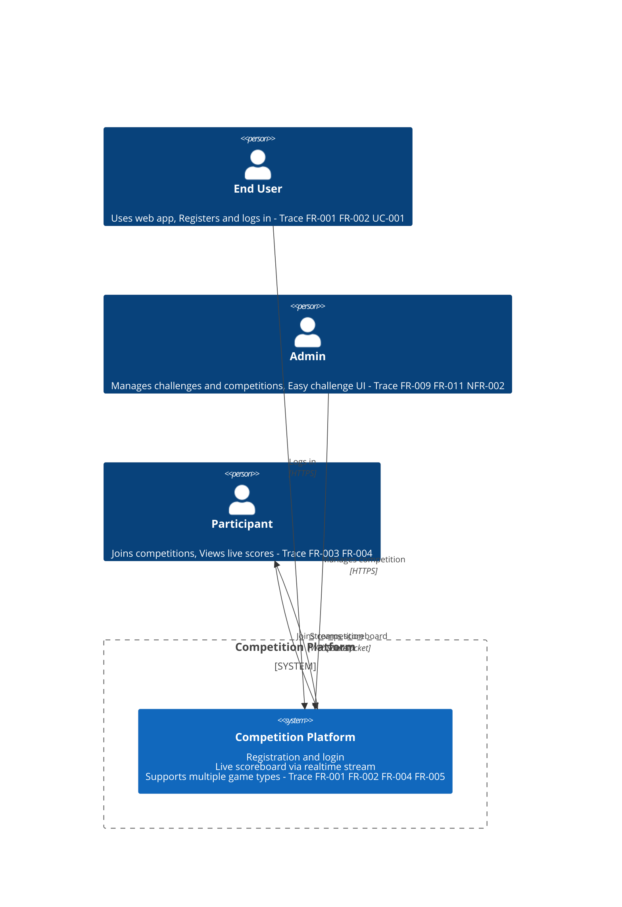

# System Context

**Type:** C4 Context
**Exported:** 2026-04-08T00:14:17.664Z
**Source:** PlanVersion

## Linked Requirements

- 35e02254-3bf0-421c-8e1c-56d03a515b36
- 9d2f5d45-a575-4828-8d25-5230c2ad8016
- 6dee6944-3cb6-41ce-89f7-99f84322c0d2
- 26ac31c6-4ddf-4d92-aa2d-bfd8dcd7832e
- 9c12d72f-ed31-464b-ad4b-d12554ecc45e
- 47129ebc-89ff-4e26-8e6e-57378789dd13
- 8520e9d8-b367-49c2-bb89-9e3ac6da844e
- d3f9b19d-5808-45dc-af8a-cf989e333f01

## Diagram

