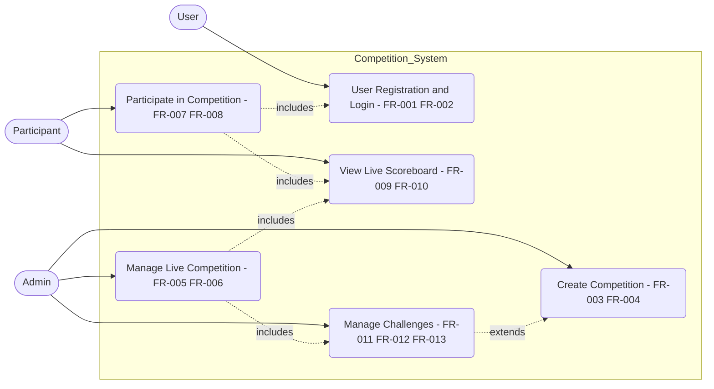

# Use Cases

**Type:** Use Case Diagram
**Exported:** 2026-04-08T00:14:57.402Z
**Source:** PlanVersion

## Linked Requirements

- 35e02254-3bf0-421c-8e1c-56d03a515b36
- 9d2f5d45-a575-4828-8d25-5230c2ad8016
- 47129ebc-89ff-4e26-8e6e-57378789dd13
- 8520e9d8-b367-49c2-bb89-9e3ac6da844e
- d3f9b19d-5808-45dc-af8a-cf989e333f01
- 2b8a1705-672e-40c2-8844-a657b729b8b2
- e8980d4e-7cc0-45b2-9492-e9843b98367d
- a951c39b-9839-4584-ab73-8450958f5a71
- 6dee6944-3cb6-41ce-89f7-99f84322c0d2
- 3020c9bd-c443-4697-a717-e977f17d120b
- 26ac31c6-4ddf-4d92-aa2d-bfd8dcd7832e
- 8ba2e7e2-3156-460f-876c-98c57399c45a
- 0a05d81c-0b16-47f3-b0d1-0f5979a8a6ac

## Diagram

